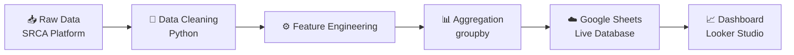

# 🚑 Data Science Internship Portfolio – SRCA
دد
```
Data Science internship at SRCA building an automated data pipeline and real-time dashboard for decision-making.


A high-impact Data Science portfolio documenting a full 220-hour internship at the Saudi Red Crescent Authority (SRCA), where data was transformed into a real-time decision-making system.

> 🚀 From manual Excel workflows → to a fully automated data pipeline & live dashboard ecosystem

---

## 👩‍💻 Author
**Shahad Almutairi**  
Data Science Graduate | Aspiring Data Scientist  

---

## 🧭 Project Summary
This portfolio captures a real-world transformation inside a humanitarian organization, where I redesigned the data workflow into a scalable, automated, and insight-driven system.

---

## 💡 Problem
- Manual reporting (slow + error-prone)  
- Fragmented datasets  
- No real-time visibility for decision-makers  

---

## ✅ Solution
- Built an automated Python data pipeline  
- Created a live Google Sheets database  
- Developed an interactive BI dashboard (Looker Studio)  

---

## ⚙️ Tech Stack
Python (Pandas) | Google Colab | Google Sheets API  
Looker Studio | Excel | PowerPoint | Canva  

---

## 🔄 Data Pipeline Architecture


## 🔗 End-to-End Data Pipeline & Live BI Integration

This section explains how the pipeline components are connected to deliver a real-time, automated reporting system.

### 🏗️ System Architecture

The solution is designed as a connected data ecosystem consisting of three main layers:

#### 1. Data Processing Layer (Python – Google Colab)
- Raw data is ingested from exported operational datasets  
- Data is cleaned, standardized, and validated using Pandas  
- Feature engineering is applied to generate key metrics such as:
  - Total Volunteers  
  - Total Volunteering Hours  
  - Beneficiaries  
  - Economic Value (SAR)  
- Aggregation logic transforms row-level data into city-level KPIs  

---

#### 2. Data Storage Layer (Google Sheets – Cloud Database)
- Processed data is automatically uploaded via Google Sheets API  
- Acts as a centralized, cloud-based, live data repository  
- Ensures:
  - Data consistency  
  - Accessibility for stakeholders  
  - Elimination of manual file handling  

---

#### 3. Visualization Layer (Looker Studio – BI Dashboard)
- Dashboard is directly connected to Google Sheets  
- Provides:
  - Real-time KPI tracking  
  - Interactive filtering (city, time period)  
  - Visual analytics (maps, charts, scorecards)  
- Enables decision-makers to monitor performance instantly  

---

### 🔄 Data Flow Pipeline

Raw Data → Data Cleaning → Feature Engineering → Aggregation → Google Sheets → Looker Studio

---

### ⚡ Automation & Real-Time Synchronization

- The pipeline is fully automated from ingestion to visualization  
- Any new dataset processed in Python is pushed instantly to Google Sheets  
- The dashboard reflects updated metrics upon refresh — with zero manual intervention  

---

### 🎯 Strategic Value

This integration transforms traditional reporting into a real-time decision-support system:

- Eliminates manual reporting workflows  
- Reduces latency between data generation and insight delivery  
- Ensures high data integrity and consistency  
- Enables scalable reporting across multiple regions and time periods  

---

### 🚀 Scalability

The architecture is designed to be reusable and scalable:
- Can handle increasing data volume without performance degradation  
- Easily extendable to other regions or departments  
- Supports future integration with more advanced data platforms  

---

## 💡 Why This Matters

Unlike static analysis projects, this system demonstrates the ability to:

- Design and implement production-level data pipelines  
- Integrate multiple platforms into a unified workflow  
- Deliver business-ready, real-time insights

---
  
## 📊 Key Features
### 🧹 Data Engineering
- Automated cleaning (missing values, formatting issues)  
- Data validation & integrity checks  
- Feature engineering (Total Volunteers, KPIs)  

### 📈 Reporting Automation
- Weekly reports generated automatically  
- KPI calculations:
  - Total Volunteers  
  - Volunteering Hours  
  - Beneficiaries  
  - Economic Value (SAR)  

### 📊 Business Intelligence Dashboard
- Real-time updates  
- Interactive filters (city / time)  
- KPI scorecards  
- Map visualization + charts  

### 🗂️ Operational Impact
- Volunteer scheduling (24/7 coverage)  
- Regional performance tracking  
- Strategic planning support  

---

## 📈 Results & Impact

| Metric | Impact |
|--------|--------|
| ⏱️ Reporting Time | ↓ 80% |
| ✅ Data Accuracy | 100% |
| 👥 Volunteers Analyzed | 1000+ |
| 💰 Economic Value | 500K+ SAR |
| 🌍 Coverage | Makkah Region |

---

## 🧠 What Makes This Project Strong
- Real-world production-level data pipeline  
- Combines Data Engineering + BI + Operations  
- Built for decision-makers, not just analysis  
- Clear business impact (time, cost, efficiency)  

---

## 🧩 My Role

### 🎯 Responsibilities
- Built the end-to-end pipeline  
- Automated reporting using Python  
- Developed BI dashboard  
- Ensured data quality & validation  
- Translated data → executive insights  

### 🚀 Impact
Delivered a scalable analytics system that:
- Eliminated manual reporting  
- Enabled real-time decision-making  
- Improved operational efficiency significantly  

---
## 📄 Letter of Recommendation

Received an official recommendation letter recognizing:
- Strong performance in data engineering & automation  
- Ability to build scalable data pipelines  
- Contribution to real-time reporting system  

📎 [View Recommendation Letter](reports/recommendation_letter.pdf)
---

## 🔗 Dashboard
*
*

---

## 📁 Project Structure
```bash 
data-science-internship/
├── README.md
├── notebooks/
│ └── srca_pipeline.ipynb
├── reports/ 
│ └── final_report.pdf
│ └── recommendation_letter.pdf
├── presentation/
│ └── final_presentation.pptx
